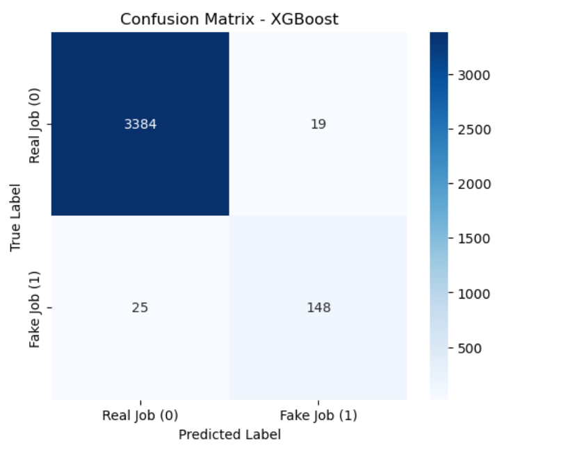
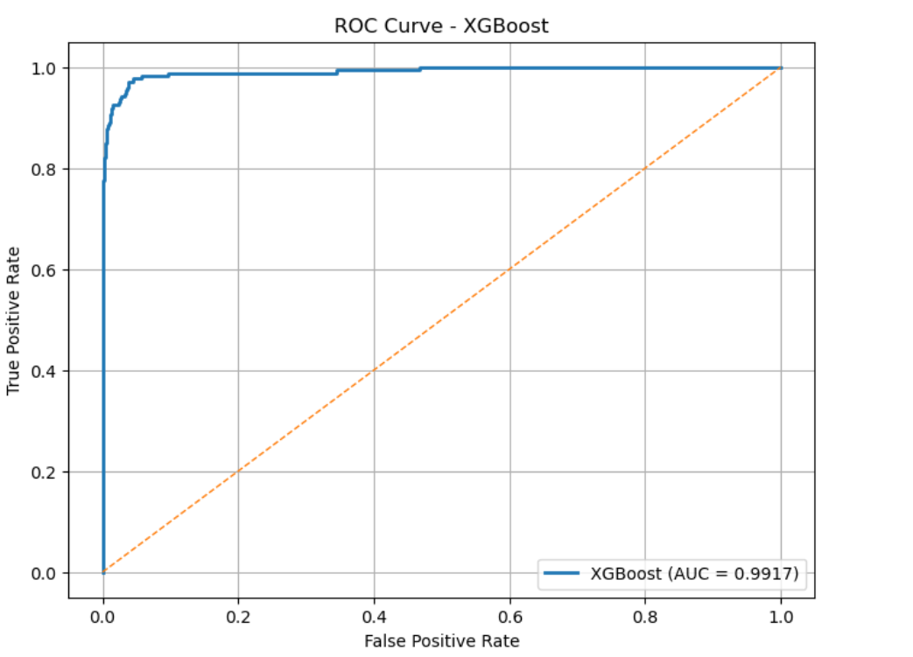
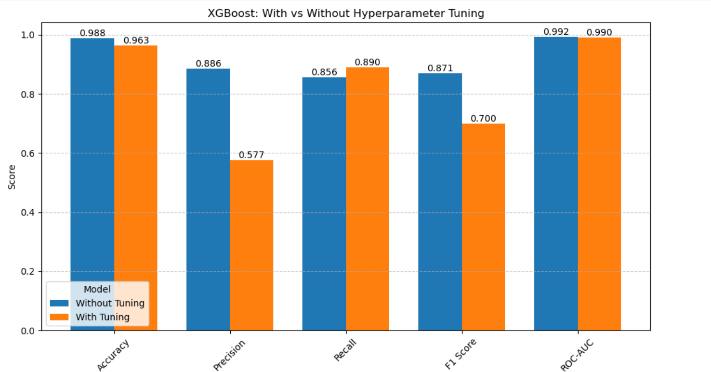
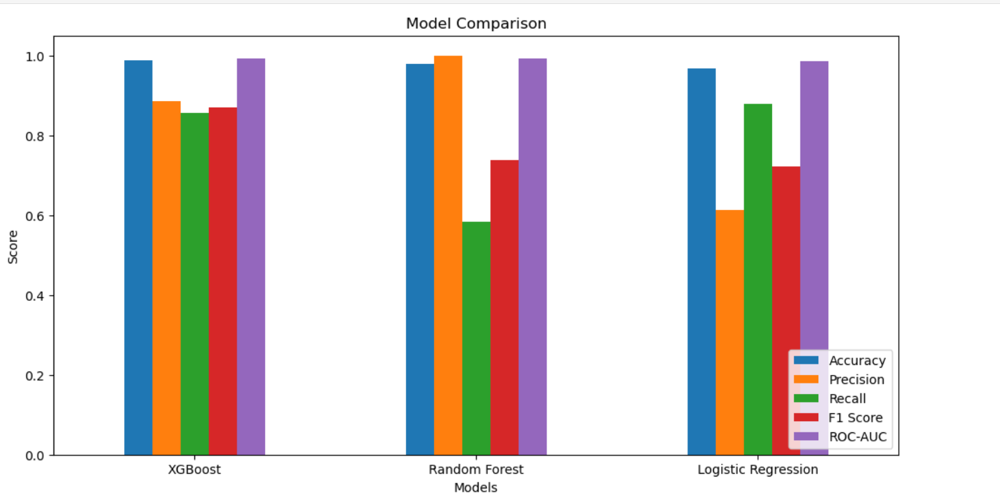
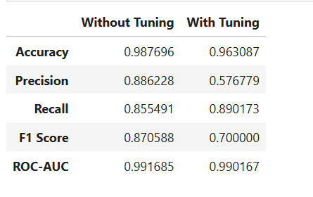

# Screenshots
This folder contains all visual outputs and evaluation results from the **Fake Job Detection NLP-ML** project.

---

## Model Comparison

A side-by-side comparison of the three models evaluated in this project — showing performance metrics across Logistic Regression, Random Forest, and XGBoost.

---

## Confusion Matrix (XGBoost)

The confusion matrix for the best-performing XGBoost model, showing true positives, false positives, true negatives, and false negatives on the test set.

---

## ROC Curve

The Receiver Operating Characteristic (ROC) curve illustrating the trade-off between the true positive rate and false positive rate. A higher AUC indicates better classifier performance.

---

## Hyperparameter Tuning — Visual Comparison

A visual comparison showing the effect of hyperparameter tuning on model performance.

---

## Visualization Comparison

An additional comparison chart providing a broader view across model configurations.

---

## XGBoost — With Tuning vs Without Tuning

A direct comparison of XGBoost model performance before and after hyperparameter tuning, demonstrating the improvement achieved through optimization.

---

*All screenshots were generated during model training and evaluation. Refer to the root [`fake_job_detection_ml_nlp.ipynb`](../fake_job_detection_ml_nlp.ipynb) notebook for the full reproducible pipeline.*

